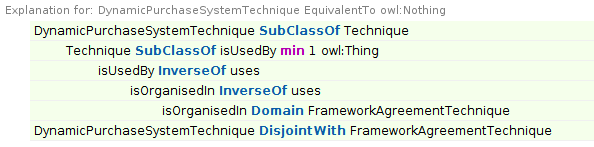

Findings of reasoning with EProcurement ontology
==================

Multiple reasoners have been used in this reasoning exercise. Each of the sections below presents the findings of reasoning with each of them. Protege  5.5.0 was used for conducting reasoning experiments. 

The succesful experiments were performed with teh following reasoners:  

- ELK 0.4.3
- FaCT++ 1.6.5  
- Hermit 1.4.3  
- Pellet (simple)


The UN-succesful experiments were performed with teh following reasoners:

- Pellet (incremental) (clear, library incompatibility, need to wait for a version upgrade)
- jcel (unclear, more debugging shall be done to understand what the error means)
- Ontop 4.1.0 (inconclusive, more time shall be spent investigating configurations)

# ELK 0.4.3

- Warnings: ELK does not support 
  -- DataPropertyRange axioms (ignored)
  -- positive occurrence of ObjectUnionOf axioms. Reasoning might be incomplete.
  -- ... many more exioms unsupported

- Supported only
 -- Property Saturation
 -- Reflexive Property Computation
 -- Object Property Hierarchy and Composition
 -- Consistency Checking 
 -- Class Taxonomy
 -- Instance Taxonomy  

**No Issues detected** mostly due to limited number of axiom types considered. 

# FaCT++ 1.6.5

- Crahs: Cannot find mapping file, inizialitazion interruptet.
- Crash: fails to start because of the unsupported datatype `http://www.w3.org/2001/XMLSchema#date`
- Crash: An error occurred during reasoning: Unsupported datatype `http://www.w3.org/2001/XMLSchema#time`
- After disabling the datatype inference. It still crashes.
- [epo-restrictions-4] replace xsd:date to xsd:dateTime (18 occurences).
- [epo-restrictions-4] replace xsd:time to xsd:dateTime (3 occurences).
- Finsihed very fast. Logs :
```
Pre-computing inferences:
    - class hierarchy
    - object property hierarchy
    - data property hierarchy
    - class assertions
    - object property assertions
    - same individuals
Ontologies processed in 177 ms by FaCT++
```
## No unsatisfiable properties were found

## Unsatisfiable classes

* ContractModificationNotice
* DynamicPurchaseSystemTechnique
* EAuctionTechnique

###  ContractModificationNotice


### DynamicPurchaseSystemTechnique



### EAuctionTechnique


## Adding data

Adding random selections of TED data (F02) (instacnes of the EPO) did not lead to any inferences about those instances. This finding is inconclussive. More attempts shall be done.  


# Hermit 1.4.3

- is slow (~1 min classes, ~1 min object properties). Does not finish on data properties.
- Disabled data properties inferences and the logs look like this
  - 11:12:58  Pre-computing inferences:
  - 11:12:58      - class hierarchy
  - 11:12:58      - object property hierarchy
  - 11:12:58      - class assertions
  - 11:12:58      - object property assertions
  - 11:12:58      - same individuals
  - 11:16:05  Ontologies processed in 187757 ms by HermiT

## Unsatisfiable classes
The following unsatisfiable classes are found
  ContractModificationNotice
  DynamicPurchaseSystemTechnique
  EAuctionTechnique
  
### ContractModificationNotice

Explanation why it is Equivalent to owl:Nothing.


### DynamicPurchaseSystemTechnique

Explanation why it is Equivalent to owl:Nothing.


### EAuctionTechnique

Explanation why it is Equivalent to owl:Nothing.


## Unsatisfiable properties
The following unsatisfiable object properties are found
  hasEAuctionUsage 
  hasModificationReason
  hasParticipationEvaluationPeriod
  modifies

### hasEAuctionUsage

Is Equivalent to : 
    hasModificationReason
    hasParticipationEvaluationPeriod
    modifies
    owl:bottomObjectProperty
    **inverse (hasEAuctionUsage)**
    inverse (hasModificationReason)
    inverse (hasParticipationEvaluationPeriod)
    inverse (modifies)

### hasModificationReason

Is Equivalent to : 
  hasEAuctionUsage
  hasParticipationEvaluationPeriod
  modifies
  owl:bottomObjectProperty
   inverse (hasEAuctionUsage)
   **inverse (hasModificationReason)**
   inverse (hasParticipationEvaluationPeriod)
   inverse (modifies)

### hasParticipationEvaluationPeriod

Is Equivalent to : 
  hasEAuctionUsage
  hasModificationReason
  modifies
  owl:bottomObjectProperty
   inverse (hasEAuctionUsage)
   inverse (hasModificationReason)
   **inverse (hasParticipationEvaluationPeriod)**
   inverse (modifies)

### modifies
Is Equivalent to : 
  hasEAuctionUsage
  hasModificationReason
  hasParticipationEvaluationPeriod
  owl:bottomObjectProperty
   inverse (hasEAuctionUsage)
   inverse (hasModificationReason)
   inverse (hasParticipationEvaluationPeriod)
   **inverse (modifies)**

## Adding data

Adding random selections of TED data (F02 - 002775_2020) (instacnes of the EPO) lead to first of all slow performance of Hermit reasoner. 
Hermit performs teh reasoning very slower. Very very slow. ~1h half way through class hierarchy calculation. Finally, cancelled the process.  


# Pellet 

- this reasoner is very fast (~300 ms), and yelds classification issues .
- No explanations are offered. 
- Many classes are unsatisfiable . 

## Classes unsatisfiable

* AdditionalDocument
* Agent
* Amount
* AwardDecision
* Business
* Buyer
* BuyerProfileNotice
* CallForCompetition
* CallForExpressionOfInterest
* CandidateShortList
* CentralPurchasingBody
* Contract
* ContractAwardNotice
* ContractModificationNotice
* ContractNotice
* Contractor
* ContractTemplate
* DescriptiveDocument
* Document
* DraftCV
* DynamicPurchaseSystemTechnique
* EAuctionTechnique
* ECatalogue
* EconomicOperator
* EconomicOperatorShortList
* ESPDRequest
* ESPDResponse
* EvaluationBoard
* EvaluationResult
* EvaluationSystem
* Evaluator
* FinancialTenderDocument
* FrameworkAgreement
* FrameworkAgreementTechnique
* FrameworkAgreementTerm
* GreenProcurement
* InnovativeProcurement
* InvitationToTender
* Lot
* LotGroup
* Measure
* Mediator
* Notice
* Organisation
* OrganisationGroup
* Period
* Person
* PlannedProcurementPart
* PreAwardCatalogueRequest
* PreAwardCatalogueResponse
* PriorInformationNotice
* Prize
* Procedure
* ProcurementDocument
* ProcurementServiceProvider
* PublicOrganisation
* PurchaseContract
* Purpose
* QualificationSystem
* Quantity
* RequestForParticipation
* Reviewer
* Role
* SecurityClearanceTerm
* SocialProcurement
* StatisticalInformation
* Subcontract
* Subcontractor
* SubmissionTerm
* System
* TechnicalSpecification
* TechnicalTenderDocument
* Technique
* Tender
* TenderDocument
* Tenderer
* TenderEvaluation
* TenderLot
* TenderLotEvaluationRank
* Value
* VoluntaryEx-anteTransparencyNotice
* Winner

## Debug session

- if the restrinctions file is opened (importing the core) and teh reasoner is executed then some classes are found unsatisfiable.  
  
- if **the core file is merged with the restrictions file** and the Pellet reasoner is executed then the reasoner finds no unsatisfiable classes. **[strange]**


- [epo-restrictions-1] will try to now open teh restrictions file and start deleting axioms until the selected class is satisfiable. 
** after commenting the following restrictions the Amount class is no longer unsatisfiable
  ```
  rdfs:subClassOf [
      rdf:type owl:Restriction ;
      owl:cardinality 1 ;
      owl:onProperty epo:hasAmountValue ;
    ] ;
  rdfs:subClassOf [
      rdf:type owl:Restriction ;
      owl:cardinality 1 ;
      owl:onProperty epo:hasCurrencyID ;
    ] ;
  ```
  
- [epo-restrictions-2] hasCurrencyID and hsaAmountValue are marked as functional properties.  Commenting out the functionalProperty flag on each property did not eliminate the unsatisfiability issue. 

- [epo-restrictions-3] removing the domain declarations for hasCurrencyID and hsaAmountValue which is set to be epo:Amount class. This did not solve the issue.

# Pellet (incremental)

- Runs out of memory (500 Mb max limit set by default) and does nto finish.
- Increased max memory to 12000M (~12 Gb)
- Crashes: for library incompatibility

# jcel 

- Crash: An error occurred during reasoning: Object cannot be translated: 'Value'..

# Ontop 4.1.0

- Crash: could not get configurations.


# Conclussions

#### Pellet 

Pellet reasoner shall not be used, as its results are impossible to trace.
  
#### Hermit

Hermit is slowish (4 minutes) but reliable. 
Finds class inconsistencies.
Finds property inconsistencies. 
  
#### FaCT++

FaCT++ si very fast, reliable as it offers explanations; BUT apparently incomplete because it does not find the contradictions over the object properties. 
However, more investigation shall be performed into the ontology structure to conclude whether the property contradictions are really the case.   


